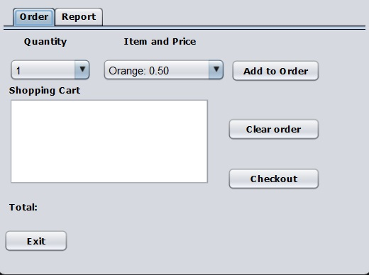
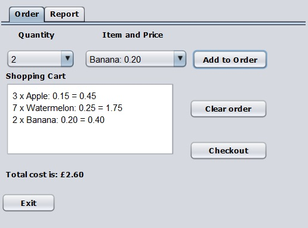
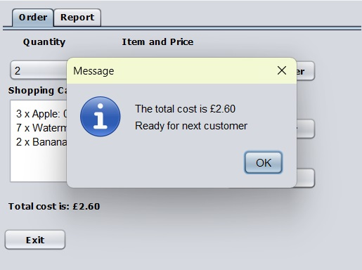
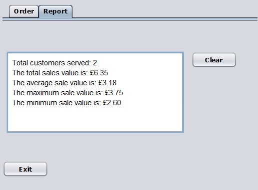

# Project Title
EposSimple

## Description
This is a simple Java Swing application where an user can add product to a cart and check them out. The project is still under development.

## Features
- "Checkout" functionality (Note: no real monetary transactions involved).
- Manager functionalities: view all orders and the related stats.

## Getting Started

### Dependencies
- Libraries used: ucanaccess-2.0.9.3, commons-lang-2.6, commons-logging-1.1.1, hsqldb, jackcess-2.0.8
- The project is using Java Development Kit (JDK) version 16

### Installing and Running
- Simply download/clone the repository, then right click on the project and select "Run". You can also run the .jar file in the dist folder.

## License
This project is not licensed for reuse, modification, or distribution.

## Contact
- Full name: Manuele Tacchetti
- Email: manuele.tacchetti@gmail.com

